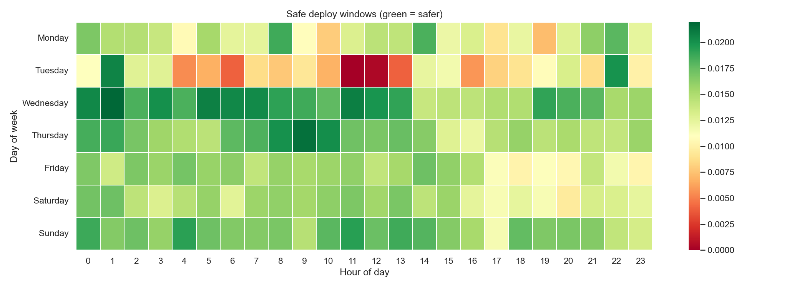
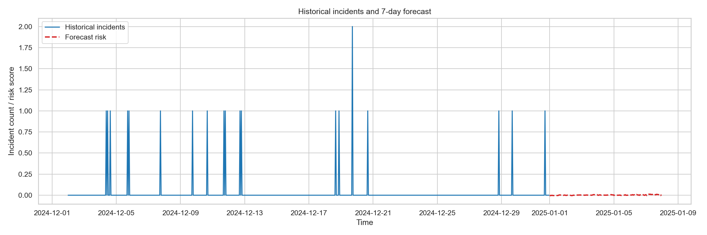

# deployment-risk-prediction

Deploying is a risk. Not deploying is a bigger one. What if data could help us pick the right moment?

## Why this exists

Availability is at the centre of how I think about engineering. Teams that ship reliably aren't the ones that avoid risk — they're the ones that understand it.

Meta recently published their [Diff Risk Score](https://engineering.fb.com/2025/08/06/developer-tools/diff-risk-score-drs-ai-risk-aware-software-development-meta/) — using AI to flag risky code changes before they land. Impressive work. It got me thinking about a complementary angle: not _what_ you're deploying, but _when_.

Google released [TimesFM](https://github.com/google-research/timesfm) — a foundation model purpose-built for time-series forecasting. No fine-tuning, no training pipeline. Feed it historical patterns and it forecasts. This felt like a natural fit.

So I built a small PoC to explore the idea.

## What it does

Takes synthetic operational data — deploy rhythms, traffic spikes from live events, incident patterns — and uses TimesFM to forecast the next week's risk windows.

The output is a heatmap of when incidents are most likely. Not a gate that blocks deploys. A signal that helps teams choose their moment.

## The scenario

Simulates a sports-streaming-like platform with:

- **Traffic spikes** — midweek Champions League / Libertadores evenings, weekend match blocks
- **Deploy rhythms** — weekday concentration peaking at 17:00, Friday slow-down, near-zero weekends
- **Two incident types** — deploy mistakes (human error under pressure) and load incidents (infrastructure stress during peak traffic)

The dangerous overlap: deploying right before high-traffic windows.

## Project structure

```
├── deployment_risk.ipynb   # Main notebook — forecast + visualizations
├── synthetic_data.py       # Synthetic data generator (swap with your own)
├── requirements.txt
├── data/                   # Generated CSVs
└── output/                 # Heatmaps and charts
```

## Using your own data

The data generation lives in `synthetic_data.py`, separate from the notebook. To use real operational data, replace the three generator functions (or write your own loader) matching these schemas:

| Function | Columns |
|---|---|
| `generate_match_events` | `timestamp`, `tournament`, `traffic_multiplier` |
| `generate_deploy_events` | `timestamp`, `is_critical_fix`, `deploy_size` |
| `generate_incidents` | `timestamp`, `incident_type`, `severity` |

## Quick start

```bash
pip install -r requirements.txt
jupyter notebook deployment_risk.ipynb
```

Run all cells. The notebook imports the data generators, runs the TimesFM forecast, and produces the visualizations.

> Requires `torch` and `timesfm`. If TimesFM fails to load, the notebook will stop with an error so you can fix the environment.

## Output

**When NOT to deploy:**


**Safe deploy windows:**



**Historical incidents + 7-day forecast:**



## Limitations

- Synthetic data only — no production signals
- Simplified incident probability model
- Not production-ready — this is a PoC to explore the idea

## Inspiration

- [Google TimesFM](https://github.com/google-research/timesfm) — zero-shot time-series foundation model
- [Meta's Diff Risk Score](https://engineering.fb.com/2025/08/06/developer-tools/diff-risk-score-drs-ai-risk-aware-software-development-meta/) — AI-driven deploy risk at scale
